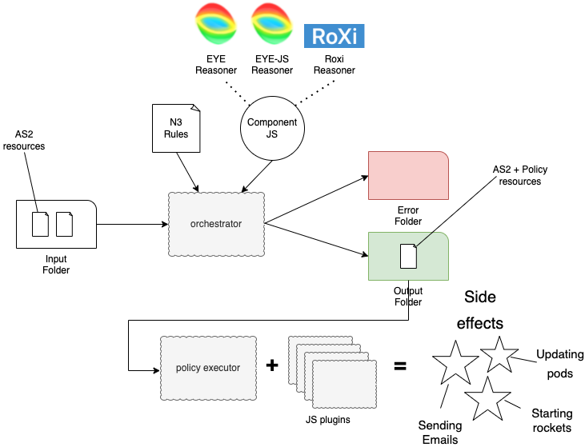

# Koreografeye

This is a miniature implementation of an choreographer implementing the [Orchestrator for a decentralized Web network](https://mellonscholarlycommunication.github.io/spec-orchestrator/) specification using the [EYE](https://github.com/eyereasoner/eye) reasoner as internal rule engine.

Koreografeye was created to facilitate running automated processes against [Solid](https://solidproject.org/TR/protocol) pods. Our main use case is monitoring the [LDN](https://www.w3.org/TR/ldn/) Inbox of Solid Pods for new notifications and running scripts when new data arrives.

## Architecture

Koreografeye can be run on an input directory containing one or more RDF files (in Turtle or N3 format). For each of these files one or more N3 rule scripts can be executed. The results of this execution will be put in an output directory. If the N3 output contains _Policy_ fragments, they can be executed using a _policy executor_. 

Koreografeye is mainly targeted for processing [Activity Streams](https://www.w3.org/TR/activitystreams-core/) (AS2) notifications. For each of these notifications N3 rules express one or more _Policies_ what execution steps should be executed when receiving a AS2 notification of a particular shape. The _orchestrator_ component reads all incoming AS2 notifications and executes the EYE reasoner (or EYE-JS, Roxi,... via configuration) on each of them and writes the results to an output directory. Policies are implemented as JavaScript plugins and can be execute by a _policy executor_.



A Policy is an RDF snippet that explains what should happen when running N3 rules against an AS2 input resource is successfull. Each policy has a name (identifier) and zero or more instances of an [fno:Execution](https://fno.io/spec/#fn-execution), which defines what JavaScript implementation should be executed. Optionally zero or more execution parameters can be provided for each execution.

The example below is an example of a Policy (prefix declarations omitted):

```(turtle)
  ex:MyDemoPolicy pol:policy [
      a fno:Execution ;
      fno:executes ex:helloWorld ;
      ex:text "Hello, world!" ;
  ] .
```

This policy requests the execution of a `ex:helloWorld` implementation with one parameter `ex:text` with value `"Hello, world!"`.

The `ex:MyDemoPolicy` can be the result of an N3 rule (prefix declarations omitted):

```(turtle)
{
  ?id a as:Announce.
}
=>
{
  ex:MyDemoPolicy pol:policy [
      a fno:Execution ;
      fno:executes ex:helloWorld ;
      ex:text "Hello, world!" ;
  ] .
}.
```

The N3 above states: "If we find an AS2 notification of type `as:Announce`, then request executing the `ex:MyDemoPolicy`.

## Installation

```
npm install
```

## Usage

### Command line

- Put ActivityStreams notifications in the `in` directory
- Put N3 rules in the `rules` directory
- Run `bin/orch --keep rules/*` to run the rules on alle in notification in the `in` directory
    - Use the `--keep` option if you don't want to automatic clean the `in` after processing notifications
    - The processed notifications will end up in the `out` directory
    - _Alternative_: run `npm run orch`
- Run `bin/pol --keep` to run the policy executor with all the processed notifications from the `out` directory
    - Use the `--keep` option if you don't want to automatic clean the `out` after processing notifications
    - _Alternative_: run `npm run pol`
- If you want to experiment with expressing N3 rules as [RDF Surfaces](https://josd.github.io/surface/) use the following commands:
    - run `npm run orch:blogic` : this will execute the [rules/blogic/00_demo.n3](rules/blogic/00_demo.n3) rule which is a direct translation of [rules/00_demo.n3](rules/00_demo.n3) in the RDF Surfaces language
    - run `npm run orch:policy` : this will read [rules/blogic/00_policy.n3](rules/blogic/00_policy.n3) (written in a small DSL language) and compile these rules into RDF Surfaces using a compiler available in [rules/blogic/policy](rules/blogic/policy) 

### Typescript/javascript

Small javascript example to execute Koreografeye using [`demo.ttl`](./data/demo.ttl) and [`00_demo.n3`](./rules/00_demo.n3).

```javascript
const { EyeJsReasoner } = require('./dist/orchestrator/reasoner/EyeJsReasoner')
const { executePolicies } = require('./dist/policy/Executor');
const { parseAsN3Store, readText, storeAddPredicate } = require('./dist/util');

const store = await parseAsN3Store('./data/demo.ttl'); // input graph
const rules = [readText('./rules/00_demo.n3')]; // array of n3 rules serialized as string

// add main subject and origin for the reasoner
const mainSubject = 'urn:uuid:42D2F3DC-0770-4F47-BF37-4F01E0382E32';
storeAddPredicate(store, 'https://www.example.org/ns/policy#mainSubject', mainSubject);
storeAddPredicate(store, 'https://www.example.org/ns/policy#origin', './data/demo.ttl');

// execute reasoning (orchestration)
const reasoner = new EyeJsReasoner([ "--quiet" , "--nope" , "--pass"])
const reasoningResult = await reasoner.reason(store, rules);

const plugins = loadConfig('./plugin.json'); // configuration for the policy executor

// execute policies
await executePolicies(plugins, reasoningResult);
```

Note: for this code to run, the project has to be compiled first (`npm run build`).

## Commands

### orch

Run the orchstrator with one or more N3 rule files on an input directory
of notifications.

*bin/orch [options] rule [rule ...]*

Options:

- --config *file* : orchestrator configuration file
- --in *directory* : directory with input notifications
- --out *directory* : directory with orchestrator output
- --err *directory* : directory with failed notifications
- --keep : keep the --in data (don't delete after processing)

### pol

Run a policy executor on one of the output files of the orchestrator

*bin/pol [options] file*

Options:

- --config *file* : orchestrator configuration file
- --info : verbose messages
- --debug : debug messages
- --trace : trace messages

Requires:

- `plugin.json` : configuration file with JavaScript plugin

Example configuration:

```
{
    "http://example.org/sendEmail": "./plugin/sendEmail"
}
```

Each plugin should implement a `policyTarget` function with the following
signature:

```
export async function policyTarget(mainStore: N3.Store, policyStore: N3.Store , policy: IPolicyType) : Promise<boolean>;
```

where:

- mainStore: an `N3.Store` containing the parsed input file (without the policies)
- policyStore: an `N3.Store` containing the current active parsed policy
- policy: an `IPolicyType` structure containg all parameters for the requested policy:
    - *node*   : `N3.NamedNode | N3.BlankNode` : the policy node ()
    - *path*   : `string` : path to the input file
    - *policy* : `string` : identifier of the policy instance
    - *target* : `string` : identifier of the policy target
    - *mainSubject* : `string` : the activity identifier of the notification
    - *origin* : `string` : path to the original notifiction input file
    - *args*   : `any { [key: string] : RDF.Term | undefined }`  : key/value pairs of all arguments that were provided for the policy
    - *config* : `any { [key: string] : any}` : configuration settings from plugin.json for the target

An example `IPolicyType` contents (in JSON):

_After running rules/00_demo.n3 on data/demo.ttl_

```
{
    "node": {
        "termType": "NamedNode",
        "value": "http://example.org/MyDemoPolicy"
    },
    "path": "out/demo.ttl",
    "policy": "bc_0_b1_b0_bn_1",
    "target": "http://example.org/demoPlugin",
    "args": {
        "http://www.w3.org/1999/02/22-rdf-syntax-ns#type": {
            "termType": "NamedNode",
            "value": "https://w3id.org/function/ontology#Execution"
        },
        "https://w3id.org/function/ontology#executes": {
            "termType": "NamedNode",
            "value": "http://example.org/demoPlugin"
        },
        "http://example.org/param1": {
            "termType": "Literal",
            "value": "my@myself.and.i",
            "language": "",
            "datatype": {
                "termType": "NamedNode",
                "value": "http://www.w3.org/2001/XMLSchema#string"
            }
        },
        "http://example.org/param2": {
            "termType": "Literal",
            "value": "you@yourself.edu",
            "language": "",
            "datatype": {
                "termType": "NamedNode",
                "value": "http://www.w3.org/2001/XMLSchema#string"
            }
        },
        "http://example.org/body": {
            "termType": "NamedNode",
            "value": "urn:uuid:42D2F3DC-0770-4F47-BF37-4F01E0382E32"
        }
    },
    "mainSubject": "urn:uuid:42D2F3DC-0770-4F47-BF37-4F01E0382E32",
    "origin": "file:///var/folders/g8/czx2gjfs3_bbvvk1hjlcsj9m0000gn/T/in/demo.ttl",
    "config": {}
}
```

## Known issues

- Policies **must** be provided using named nodes:

*correct*

```
 ex:MyDemoPolicy pol:policy [
      a fno:Execution ;
      fno:executes ex:demoPlugin ;
      ex:param1 "my@myself.and.i" ;
      ex:param2 "you@yourself.edu" ;
  ] .
```

*incorrect*

```
 [ pol:policy [
      a fno:Execution ;
      fno:executes ex:demoPlugin ;
      ex:param1 "my@myself.and.i" ;
      ex:param2 "you@yourself.edu" ;
      ex:subject "A new resource was created!" ;
      ex:body ?s 
  ] ] .
```